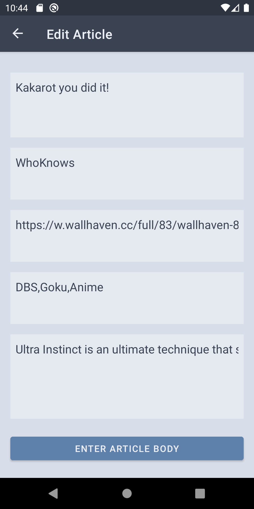
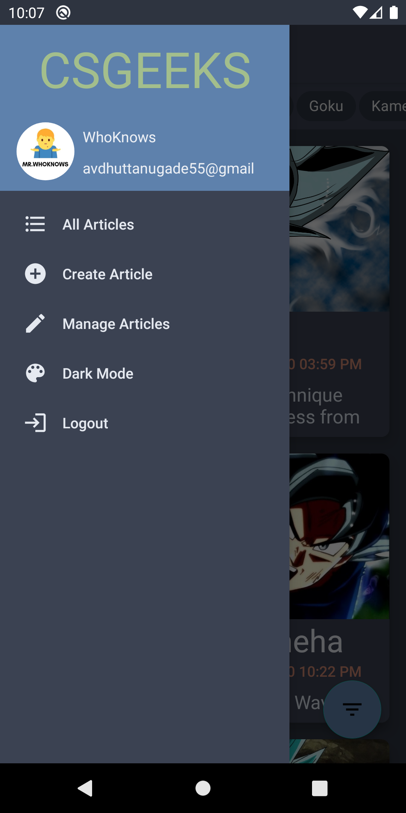

# CS GEEKS BLOG APP

## About   
Simple blog app that shows different blog articles from a HTTP API.
- Shows Markdown rendered articles. 
- Simple Material UI.
- Both dark and light themes are supported.
- Authors can login and do CRUD operations.
- Create, Update, Delete article support.
- Can navigate between the website and app (deeplinks).

## You can download & install latest app ⬇   

## Screenshots
<table>
  <tr>
    <td></td>
    <td></td>
    <td></td>
  </tr>
  <tr>
    <td></td>
    <td></td>
    <td></td>
  </tr>
    <tr>
    <td></td>
    <td></td>
    <td></td>
  </tr>
</table>    

## Built using
- [Kotlin 💙](https://kotlinlang.org/) - Official programming language for Android development.
- [Android Architecture Components](https://developer.android.com/topic/libraries/architecture)
  - [LiveData](https://developer.android.com/topic/libraries/architecture/livedata)
  - [ViewModel](https://developer.android.com/topic/libraries/architecture/viewmodel)
- [Jetpack Navigation Component](https://developer.android.com/guide/navigation/) - For Activity/Fragment navigation.
- [MVVM Architecture](https://www.journaldev.com/20292/android-mvvm-design-pattern) - Architecture pattern.
- [Retrofit](https://square.github.io/retrofit/) - HTTP client for Android.
- [Coroutines](https://kotlinlang.org/docs/reference/coroutines-overview.html) - For asynchronous programming.
- [Gson](https://github.com/google/gson) - For JSON conversion.
- [Glide](https://github.com/bumptech/glide) - For image loading.
- [Markwon](https://github.com/noties/Markwon) - For Markdown rendering.
- [Material Design Components for Android](https://material.io/android) - For Material UI.
- [DotLoadersPack-Android](https://github.com/agrawalsuneet/DotLoadersPack-Android) - Material progressbar with dots loaders
- [Nord Colors 💚](https://www.nordtheme.com/) - Color scheme.